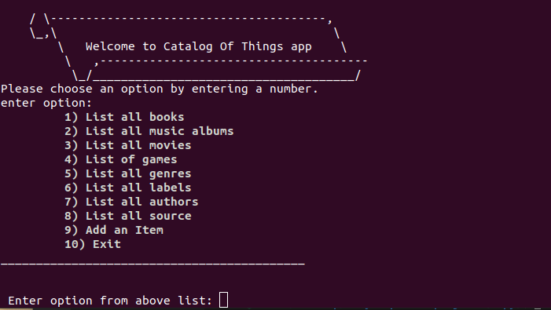

# Catalog Of Things Ruby

> This project is the capstone project of Ruby module. , it demonstartes OOP concept of the Ruby language through creating classes and constructors, in addition to other features like methods, inheritance and more.

## Screenshot

## Presentation
[Video](https://youtu.be/UfSsahg91uI)

## Getting started
  Run the following commands on the terminal your local machine:

  - `git clone https://github.com/Rayan84/catalog-of-things-ruby.git`
  - `cd catalog-of-things-ruby`
  - `bundle`
  - `ruby the/path/to/main.rb`

## Tests
  Run the below command on the terminal:
  
  - `rspec`

## Authors

👤 **Rayan Rassam**

- GitHub: [@Rayan84](https://github.com/Rayan84)
- Twitter: [@Rayan65096267](https://twitter.com/Rayan65096267)
- LinkedIn: [Rayan Rassam](https://www.linkedin.com/in/rayan-rassam/)

## 🤝 Contributing

Contributions, issues, and feature requests are welcome!

Feel free to check the [issues page](../../issues/).

## Show your support

Give a ⭐️ if you like this project!